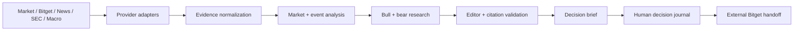

# Scry AI

**See what moved while you slept.** Scry AI is an AI research desk for 24/7 tokenized US-stock markets: it assembles inspectable evidence and competing theses, while the human records the final decision and executes externally on Bitget.

Live demo: [scry-ai.vercel.app](https://scry-ai.vercel.app)

Tokenized stocks can trade while their underlying US exchanges are closed. That creates a fragmented research problem: the price can move while official equity markets, filings, company news, macro context, peers, and on-chain liquidity tell different parts of the story. Scry turns those inputs into one evidence-bound movement investigation.

The desk detects or selects a move, normalizes timestamped evidence, constructs independent market, event, bull, and bear analyses, then reconciles them into a cited brief with explicit invalidations. Material statements refer only to evidence IDs retrieved for that run. The user chooses **Bullish**, **Bearish**, **No Trade**, or **Watch**. Scry never connects a wallet, holds funds, or submits orders.



## Current provider modes

The repository runs immediately in **Snapshot demo data** mode. The committed fixture is captured at `2025-08-27T20:00:00Z` and covers NVDA, TSLA, AAPL, and COIN. It never generates random prices or presents the fixture as live. `/api/health` reports which optional credentials are configured. Server adapters and environment names are ready for Qwen, Bitget Wallet RWA data, an equity provider, news, FRED, and Supabase; the shipped UI uses the deterministic fixture until those provider integrations are configured and enabled.

Primary links retained in the evidence fixture include NVIDIA Investor Relations, SEC EDGAR, Tesla Investor Relations, and Coinbase Investor Relations. The Bitget handoff uses the official Web3 swap marketplace and tells the user which tokenized ticker to search; it does not invent an exact asset route.

## Setup

Requirements: Node.js 20+ and npm.

```bash
cp .env.example .env.local
npm install
npm run dev
```

Open `http://localhost:3000`. No credentials or login are required for the demo. To enable external services, fill the relevant values in `.env.local`; never expose server keys with a `NEXT_PUBLIC_` prefix. See `.env.example` for every variable. Optional persistence uses the schema in `supabase/migrations/001_initial.sql`.

Production checks:

```bash
npm run typecheck
npm run lint
npm run build
```

## Three-minute demo

1. Open the desk and point out the dated snapshot label.
2. Select NVDA; toggle underlying/tokenized observations and open a linked evidence source.
3. Click **Investigate move** and watch the five research stages.
4. Compare the bull case, bear case, contradiction, invalidation map, and evidence-quality score.
5. Record **Watch** with a reason, then open the Decision journal.
6. Open the shareable NVDA brief at `/briefs/snapshot-nvda`.
7. Click **Trade on Bitget ↗** and explain that Scry hands control to the user on an external venue.

The reproducible request and condensed result live in `samples/`. Full fixture data lives in `fixtures/market.ts`.

## Limitations

The committed demo is historical snapshot data, not investment advice or a live market feed. Live provider adapters require credentials and provider-specific endpoint validation. The fallback Bitget URL is marketplace-level rather than an exact instrument route. Browser-local decisions do not sync across devices without Supabase. Tokenized instruments may diverge from underlying equity prices because venue hours, liquidity, tracking, and settlement differ. The confidence score measures evidence quality, not the probability of a price outcome.

## Hackathon alignment

Scry AI targets the Bitget AI Base Camp S2 **AI Trading Desk** track. Its signature movement investigation is designed for around-the-clock tokenized equities; its trust layer makes sources, freshness, contradictions, and missing data inspectable; and its explicit decision boundary preserves human control before the Bitget handoff.

More detail: [Architecture](docs/ARCHITECTURE.md) · [Methodology](docs/METHODOLOGY.md) · [Demo script](docs/DEMO-SCRIPT.md) · [Submission](docs/SUBMISSION.md)
