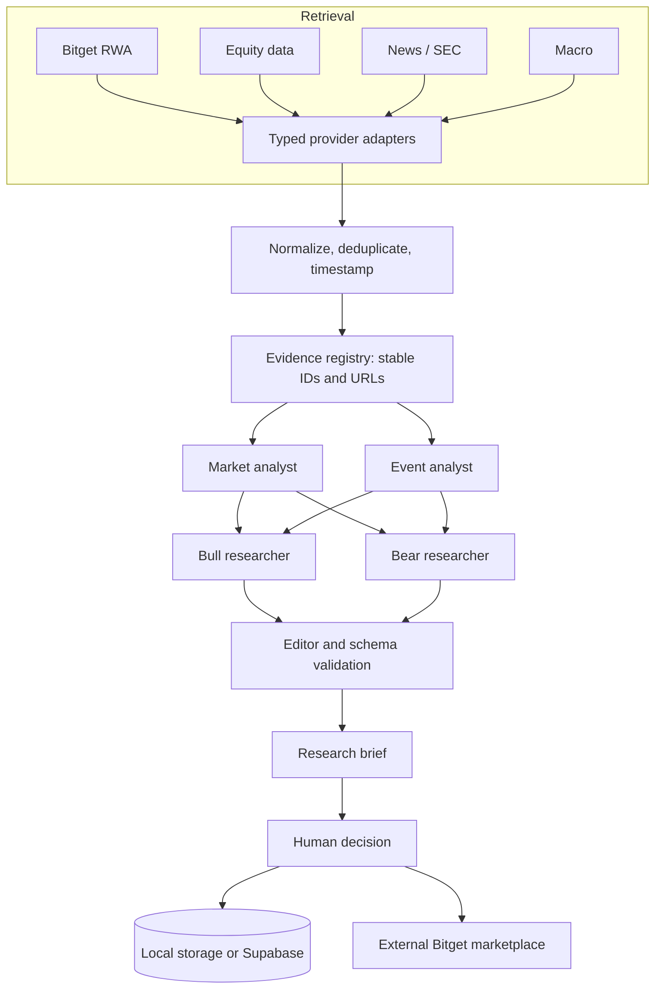

# Architecture

Scry uses the Next.js App Router for the UI and server routes. Browser code receives normalized response objects only; provider and persistence secrets remain on the server.

The current fixture path enters at the normalization boundary, which keeps the UI and research contract identical across live and demo modes. APIs validate bounded inputs with Zod and apply lightweight in-process rate limits. A production deployment should replace those limits with a shared store when scaled across instances.

Research output carries the model name, prompt version, data mode, and generation time. The editor is allowed to cite only evidence IDs in the run registry. Unknown IDs and malformed URLs must be removed server-side before persistence.
